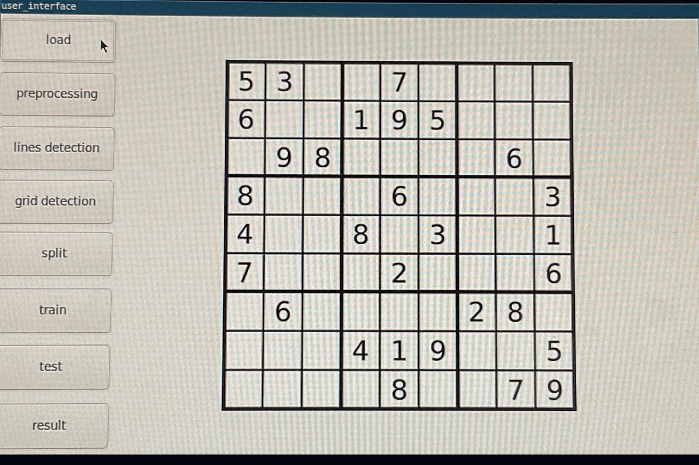
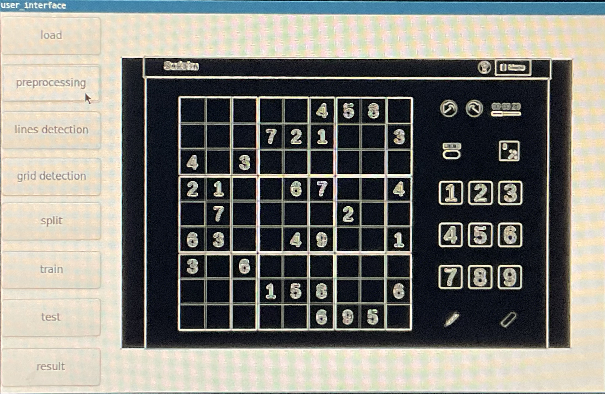
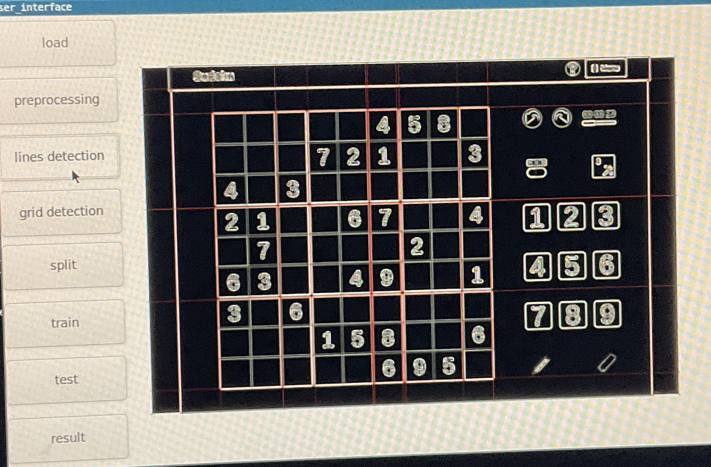
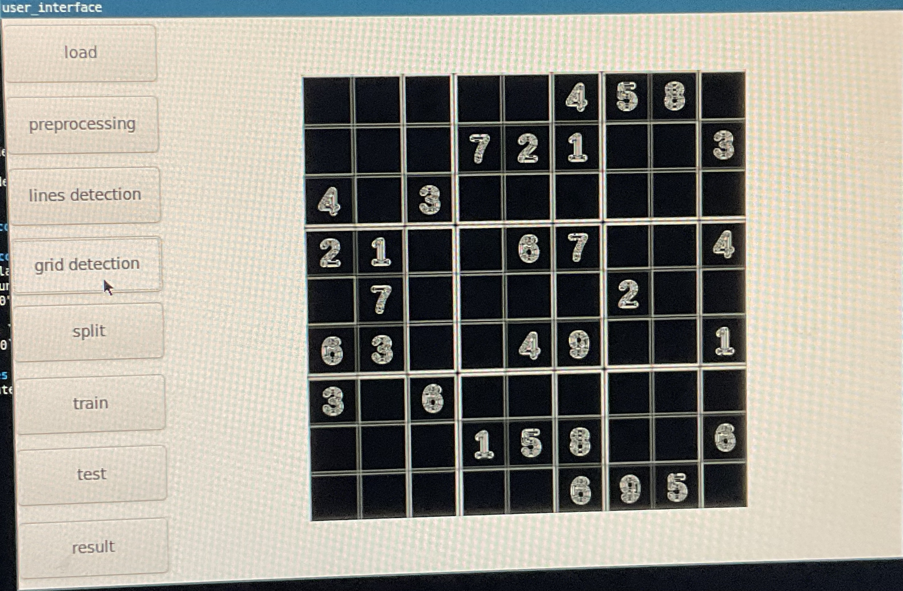
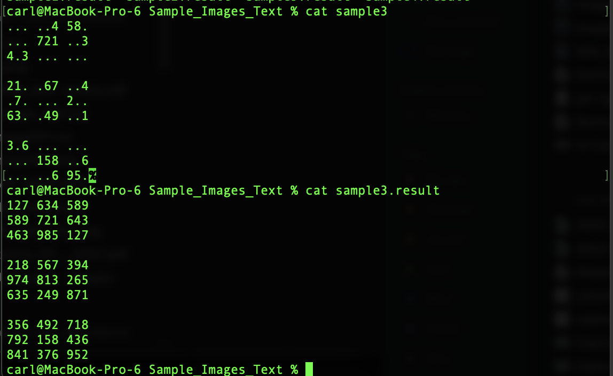

<p align="center">

</p>


# OCR- SUDOKU SOLVER
THIS PROGRAM IS ABLE TO RECOGNISE A SUDOKU GRID IN AN IMAGE, SOLVE IT, THEN RETURN AN IMAGE OF THE SOLUTION.

Find below information about the repository and instructions on how you can run the app and explanations on the different folders.

# Information
  • Implemented using the **C** language.  
  • UI implemented using **GTK** framework with **glade**.  
  • Image operations implemented using **SDL**, **SDL_Image** and **SDL_gfx**.  
  • All **Makefiles** are made available for each folder.
  • Implented the Hough algorithm for line detection, as well as a Neural Network for recognising digits.  
	
# How to run the app ?
• Install SDL ```brew install sdl```.

• Install GTK ```brew install gtk+3```.

• Clone the repository and move to the **UI** folder then enter the ```make``` command.

• Then run the ```user_interface```executable file ```./user_interface```. 

• Once the UI opened, you can use the images provided in **Sample Images** in order to test/use the application.


# UI Folder explained
This is the Folder to go in order to generate the executable file. It is where the code for the GUI is and it makes use of all the other folders. After compiling (running the ```make```), you just need to run (```./user_interface```) in order to display the UI and hence use the program.
	
# Image Folder explained
Here is where all the preprocessing of the Image and detection of the Sudoku grid is done. i.e :

• Applying filters and implementing the Hough transform algorithm
	<p align="center">
	
	</p>

• Detecting lines
	<p align="center">
	
	</p>

• Detecting the grid
	<p align="center">
	
	</p>

• Splliting the image into 81 different images ( 81 cells in Sudoku )for the neural network ( done in the back- end ).


This folder has a Makefile. feel free to run it in order to understand the different functions within the scope of the folder.

# NeuralNetwork Folder explained
In this folder is implemented all the functions necessary for the recognition of the digits of the grid. It takes as input the 81 images of the above splitting and outputs the grid as a string with the correct numbers at the correct position.
	<p align="center">
	
	</p>

# Solver Folder explained
In this folder is the algorithm for solving any given Sudoku. It takes in a text file of a **grid format** (the above picture) and gives out a text file with the solved grid. There is also a main.c in this folder so feel free to run it in order to understand the different functions within the scope of the folder. The main takes one argument which is the path for the text file. In **Sample_Images_Text** are some sample grids in text file. Pass one of these grids as parameter  to the ```main``` excecutable (after compiling with ```make```) or feel free to create your own grid.
  
  
# Sample_Images Folder explained
Contains sample Images in which there is a sudoku grid in order to test the program.

# Sample_Images_Text Folder explained
Contains the text format of the sample Images.

  
